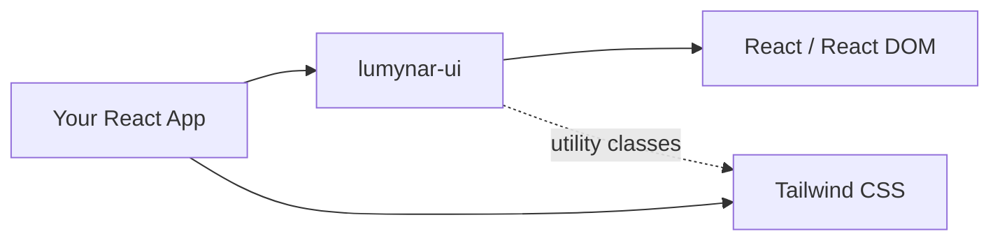

# Lumynar UI Documentation

Welcome to the Lumynar UI documentation. This guide covers everything you need to install, use, customize, test, and contribute to the library.

## What is Lumynar UI?

Lumynar UI is a small React component library that ships 19 ready-made UI primitives. Components use Tailwind CSS utility classes and are designed to be extended through props, `className`, and inline `style`.

> **Note:** Lumynar UI does not ship a standalone CSS file. Your application must include Tailwind CSS and scan the package `dist/` output.

---

## Documentation Index

### For application developers

| Document | What you'll learn |
|----------|-------------------|
| [Getting Started](./getting-started.md) | Install the package, configure Tailwind, render your first component |
| [Components](./components.md) | Props, variants, and usage examples for every exported component |
| [Customization](./customization.md) | Override styles with `className`, `style`, and Tailwind |
| [Compatibility](./compatibility.md) | Supported React versions and peer dependency notes |
| [Troubleshooting](./troubleshooting.md) | Fix common install, styling, and import issues |

### For contributors and maintainers

| Document | What you'll learn |
|----------|-------------------|
| [Architecture](./architecture.md) | Folder structure, build system, and module responsibilities |
| [Testing](./testing.md) | Run tests, coverage requirements, and testing conventions |
| [Publishing](./publishing.md) | Local linking, version bumps, and npm publish workflow |
| [Contributing](../CONTRIBUTING.md) | Branch workflow, coding standards, and PR process |

---

## Package at a glance

| Property | Value |
|----------|-------|
| Package name | `lumynar-ui` |
| Entry (CJS) | `dist/index.cjs.js` |
| Entry (ESM) | `dist/index.esm.js` |
| Peer dependencies | `react`, `react-dom` (>=15.0.0 declared; 16.8+ required in practice) |
| Runtime dependencies | None |
| Exported components | 19 |
| Styling | Tailwind CSS utility classes (consumer must configure) |

---

## Recommended reading order

### New to Lumynar UI

1. [Getting Started](./getting-started.md)
2. [Components](./components.md)
3. [Customization](./customization.md)

### Joining as a contributor

1. [Architecture](./architecture.md)
2. [Contributing](../CONTRIBUTING.md)
3. [Testing](./testing.md)

### Publishing a release

1. [Testing](./testing.md) — ensure `npm test` and `npm run test:coverage` pass
2. [Publishing](./publishing.md) — bump version and publish

---

## External links

- [npm package](https://www.npmjs.com/package/lumynar-ui)
- [GitHub repository](https://github.com/Nayem707/nayem-ui-framework)
- [Issue tracker](https://github.com/Nayem707/nayem-ui-framework/issues)

---

## Coming soon

- Documentation website
- Live component playground
- Storybook catalog
