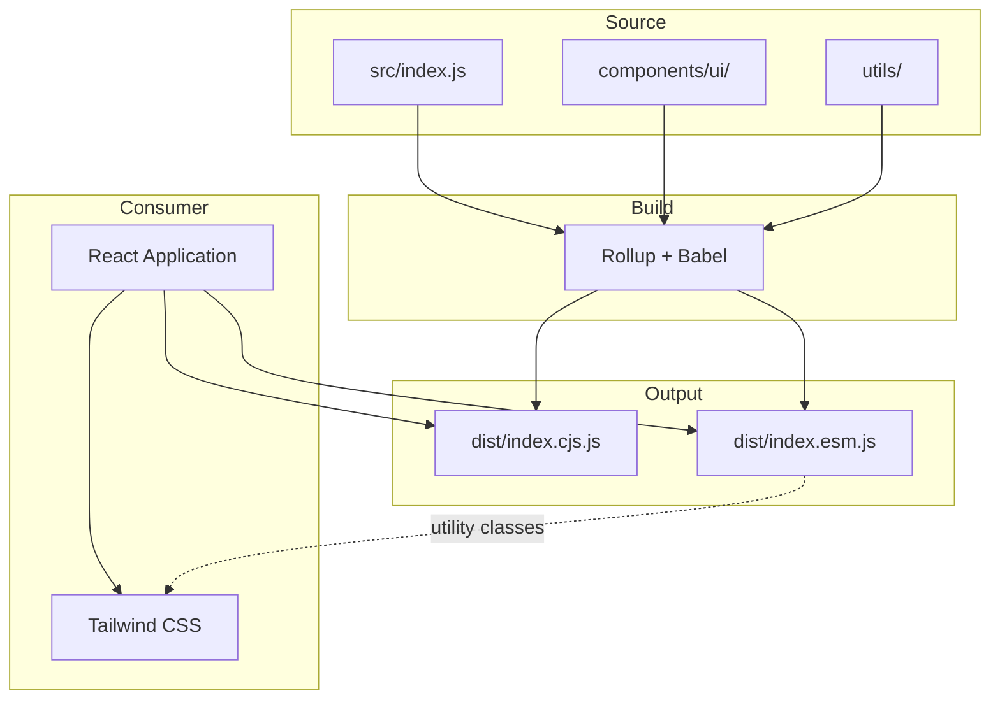
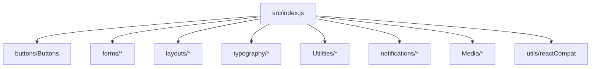

# Architecture

This document describes how Lumynar UI is structured, built, and distributed.

---

## Overview

Lumynar UI is a **library package**, not an application. It compiles React components into distributable JavaScript bundles that consumers import into their own projects.



---

## Responsibilities

| Layer | Purpose |
|-------|---------|
| `src/index.js` | Public API barrel — defines all exported components |
| `src/components/ui/` | Component source files organized by category |
| `src/utils/` | Shared utilities (`reactCompat.js`) |
| `rollup.config.js` | Build configuration (CJS + ESM output) |
| `vitest.config.js` | Test runner and coverage configuration |
| `dist/` | Published build artifacts (generated, not committed) |

---

## Folder structure

```
lumynar-ui/
├── .github/workflows/     # CI pipeline (test + build)
├── docs/                  # Documentation
├── src/
│   ├── index.js           # Public exports
│   ├── assets/            # Static assets (header image)
│   ├── utils/
│   │   └── reactCompat.js # React compatibility helpers
│   └── components/ui/
│       ├── buttons/       # Button
│       ├── forms/         # InputField, Label, Checkbox, FormWrapper
│       ├── layouts/       # Card, Container, Grid, Row, Column
│       ├── typography/    # Heading, Paragraph
│       ├── notifications/ # Alert, Toast
│       ├── Media/         # Avatar, Image
│       └── Utilities/     # Badge, Loading, Skeleton, Divider
├── dist/                  # Build output (generated)
├── coverage/              # Coverage reports (generated)
├── rollup.config.js
├── vitest.config.js
├── setupTests.js
└── package.json
```

> **Note:** Additional components exist in source (modals, tables, tabs) but are **not exported** from `src/index.js` and are not part of the public API.

---

## Technology stack

| Tool | Role |
|------|------|
| React | Component runtime (peer dependency) |
| Tailwind CSS | Utility-class styling (consumer dependency) |
| Rollup | Bundle CJS + ESM outputs |
| Babel (`@babel/preset-react`) | JSX transform during build |
| Vitest | Unit and integration tests |
| React Testing Library | Component testing |
| jsdom | Browser environment simulation |

---

## Build pipeline

### Input

- Entry point: `src/index.js`
- All imports resolved from `src/components/` and `src/utils/`

### Process

1. `rollup-plugin-peer-deps-external` excludes `react` and `react-dom` from the bundle
2. `@rollup/plugin-babel` transforms JSX to JavaScript
3. Two output formats are generated

### Output

| File | Format | Usage |
|------|--------|-------|
| `dist/index.cjs.js` | CommonJS | `require('lumynar-ui')` |
| `dist/index.esm.js` | ES Module | `import { Button } from 'lumynar-ui'` |

### Build commands

```bash
npm run build    # One-time production build
npm run dev      # Watch mode during development
```

The `prepublishOnly` script runs `npm run build` automatically before `npm publish`.

---

## Public API design

### Export policy

Only components exported from `src/index.js` are part of the public API. Importing from internal paths is unsupported and may break in any release.

```js
// Supported
import { Button } from 'lumynar-ui';

// Not supported
import Button from 'lumynar-ui/src/components/ui/buttons/Buttons';
```

### Component pattern

Every exported component follows the same conventions:

| Convention | Description |
|------------|-------------|
| Functional components | No class components |
| Props destructuring | Named props with defaults |
| `className` prop | Tailwind or custom class overrides |
| `...rest` spreading | Additional HTML attributes forwarded to the root element |
| Tailwind class maps | Variant/size props map to utility class strings |

---

## Module dependencies



`reactCompat.js` is imported for side effects at startup but its exported helpers are not used by individual components today.

---

## Testing architecture

| Aspect | Detail |
|--------|--------|
| Framework | Vitest + React Testing Library |
| Location | Co-located `*.test.jsx` files beside components |
| Environment | jsdom |
| Coverage threshold | 90% minimum (lines, branches, functions, statements) |
| CI | GitHub Actions runs tests on Node 18 and 20 |

See [Testing](./testing.md) for commands and conventions.

---

## Extension points

| If you want to… | Where to start |
|-----------------|----------------|
| Add a new exported component | Create in `src/components/ui/`, export from `src/index.js`, add tests |
| Change styling defaults | Edit Tailwind classes in the component file |
| Add TypeScript types | Planned for v0.2 — add `.d.ts` files alongside components |
| Improve accessibility | Add ARIA attributes and keyboard handlers in component files |

---

## Related documents

- [Components](./components.md) — public API reference
- [Testing](./testing.md) — test commands and philosophy
- [Publishing](./publishing.md) — release workflow
- [Contributing](../CONTRIBUTING.md) — contribution guidelines
