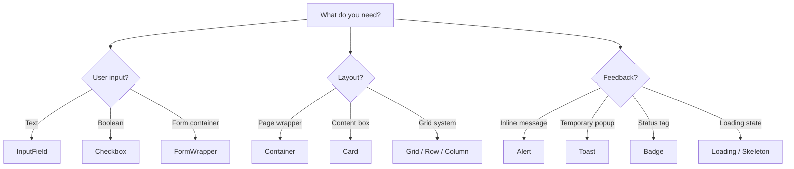

# Components

Complete API reference for all 19 components exported from `lumynar-ui`.

---

## Import

```jsx
import {
  Button,
  InputField,
  Label,
  Checkbox,
  FormWrapper,
  Card,
  Container,
  Grid,
  Row,
  Column,
  Heading,
  Paragraph,
  Badge,
  Loading,
  Skeleton,
  Divider,
  Alert,
  Toast,
  Avatar,
  Image,
} from 'lumynar-ui';
```

---

## Buttons

### `Button`

A clickable button with variant and size options.

| Prop | Type | Default | Description |
|------|------|---------|-------------|
| `children` | `ReactNode` | — | Button content (preferred) |
| `label` | `string` | — | Button text (legacy; used when `children` is absent) |
| `variant` | `'primary'` \| `'secondary'` \| `'danger'` | `'primary'` | Visual style |
| `size` | `'sm'` \| `'md'` \| `'lg'` | `'md'` | Padding and font size |
| `disabled` | `boolean` | `false` | Disables interaction |
| `className` | `string` | `''` | Custom classes (replaces default variant/size classes when provided) |
| `style` | `CSSProperties` | `{}` | Inline styles |
| `onClick` | `function` | — | Click handler |
| `...rest` | — | — | Forwarded to `<button>` |

```jsx
<Button variant="primary" size="lg" onClick={() => {}}>
  Save
</Button>
```

---

## Forms

### `InputField`

A styled text input.

| Prop | Type | Default | Description |
|------|------|---------|-------------|
| `type` | `string` | `'text'` | HTML input type |
| `placeholder` | `string` | `''` | Placeholder text |
| `value` | `string` | — | Controlled value |
| `onChange` | `function` | — | Change handler |
| `disabled` | `boolean` | `false` | Disables input |
| `id` | `string` | — | HTML `id` |
| `name` | `string` | — | HTML `name` |
| `className` | `string` | `''` | Additional classes |
| `...rest` | — | — | Forwarded to `<input>` |

```jsx
<InputField
  id="email"
  type="email"
  placeholder="you@example.com"
  value={email}
  onChange={(e) => setEmail(e.target.value)}
/>
```

### `Label`

An accessible form label.

| Prop | Type | Default | Description |
|------|------|---------|-------------|
| `children` | `ReactNode` | — | Label text |
| `htmlFor` | `string` | — | Associates label with input `id` |
| `required` | `boolean` | `false` | Shows red asterisk when `true` |
| `className` | `string` | `''` | Additional classes |
| `...rest` | — | — | Forwarded to `<label>` |

```jsx
<Label htmlFor="email" required>Email</Label>
```

### `Checkbox`

A checkbox with optional label.

| Prop | Type | Default | Description |
|------|------|---------|-------------|
| `id` | `string` | — | Input `id` (required for label association) |
| `name` | `string` | — | Input `name` |
| `label` | `string` | — | Label text (hidden when absent) |
| `checked` | `boolean` | — | Controlled checked state |
| `onChange` | `function` | — | Change handler |
| `disabled` | `boolean` | `false` | Disables checkbox |
| `className` | `string` | `''` | Classes on wrapper `<div>` |

```jsx
<Checkbox
  id="terms"
  label="Accept terms"
  checked={accepted}
  onChange={(e) => setAccepted(e.target.checked)}
/>
```

### `FormWrapper`

A `<form>` container.

| Prop | Type | Default | Description |
|------|------|---------|-------------|
| `children` | `ReactNode` | — | Form content |
| `onSubmit` | `function` | — | Submit handler |
| `className` | `string` | `''` | Additional classes |

```jsx
<FormWrapper onSubmit={handleSubmit}>
  <InputField name="email" />
  <Button type="submit">Submit</Button>
</FormWrapper>
```

---

## Layout

### `Card`

A bordered container with padding and shadow options.

| Prop | Type | Default | Description |
|------|------|---------|-------------|
| `children` | `ReactNode` | — | Card content |
| `padding` | `'none'` \| `'sm'` \| `'md'` \| `'lg'` | `'md'` | Inner padding |
| `shadow` | `'none'` \| `'sm'` \| `'md'` \| `'lg'` | `'md'` | Box shadow |
| `className` | `string` | `''` | Additional classes |
| `...rest` | — | — | Forwarded to root `<div>` |

### `Container`

A responsive centered section wrapper.

| Prop | Type | Default | Description |
|------|------|---------|-------------|
| `children` | `ReactNode` | — | Content |
| `size` | `'default'` \| `'full'` \| `'xl'` \| `'lg'` \| `'sm'` | `'full'` | Max width |
| `className` | `string` | `''` | Additional classes |

### `Grid`

A CSS Grid layout wrapper.

| Prop | Type | Default | Description |
|------|------|---------|-------------|
| `children` | `ReactNode` | — | Grid items |
| `cols` | `1`–`6` | `3` | Column configuration |
| `gap` | `'none'` \| `'sm'` \| `'md'` \| `'lg'` \| `'xl'` | `'md'` | Gap between items |
| `className` | `string` | `''` | Additional classes |

### `Row`

A flexbox row container.

| Prop | Type | Default | Description |
|------|------|---------|-------------|
| `children` | `ReactNode` | — | Row items |
| `gap` | `number` | `4` | Gap size (Tailwind `gap-{n}`) |
| `align` | `string` | `'center'` | `items-{align}` class |
| `justify` | `string` | `'start'` | `justify-{justify}` class |
| `wrap` | `boolean` | `true` | Enables `flex-wrap` |
| `className` | `string` | `''` | Additional classes |

### `Column`

A grid column or flex child.

| Prop | Type | Default | Description |
|------|------|---------|-------------|
| `children` | `ReactNode` | — | Column content |
| `span` | `number` | `1` | `col-span-{n}` when `grow` is false |
| `grow` | `boolean` | `false` | Uses `flex-1` instead of `col-span` |
| `className` | `string` | `''` | Additional classes |

---

## Typography

### `Heading`

A semantic heading element.

| Prop | Type | Default | Description |
|------|------|---------|-------------|
| `children` | `ReactNode` | — | Heading text |
| `level` | `1`–`6` | `1` | Renders `<h1>` through `<h6>` |
| `className` | `string` | `''` | Additional classes |
| `...rest` | — | — | Forwarded to heading element |

```jsx
<Heading level={2}>Page Title</Heading>
```

### `Paragraph`

A styled paragraph element.

| Prop | Type | Default | Description |
|------|------|---------|-------------|
| `children` | `ReactNode` | — | Paragraph text |
| `variant` | `'body'` \| `'small'` \| `'caption'` \| `'error'` | `'body'` | Text style |
| `className` | `string` | `''` | Additional classes |
| `...rest` | — | — | Forwarded to `<p>` |

---

## Feedback

### `Alert`

An inline alert message.

| Prop | Type | Default | Description |
|------|------|---------|-------------|
| `type` | `'info'` \| `'success'` \| `'warning'` \| `'error'` | `'info'` | Alert style |
| `title` | `string` | — | Optional bold title |
| `message` | `string` | — | Alert body text |
| `onClose` | `function` | — | Shows close button when provided |
| `className` | `string` | `''` | Additional classes |

```jsx
<Alert type="error" title="Error" message="Something went wrong." />
```

> **Note:** Use the `type` prop, not `variant`.

### `Toast`

A fixed-position toast notification.

| Prop | Type | Default | Description |
|------|------|---------|-------------|
| `type` | `'info'` \| `'success'` \| `'warning'` \| `'error'` | `'info'` | Toast style |
| `message` | `string` | — | Toast text |
| `onClose` | `function` | — | Close handler |
| `duration` | `number` | `5000` | Auto-close delay in ms (0 disables auto-close) |

```jsx
<Toast type="success" message="Saved!" onClose={() => setShow(false)} />
```

### `Badge`

A small status label.

| Prop | Type | Default | Description |
|------|------|---------|-------------|
| `children` | `ReactNode` | — | Badge text |
| `variant` | `'primary'` \| `'secondary'` \| `'success'` \| `'danger'` \| `'warning'` | `'primary'` | Color style |
| `size` | `'sm'` \| `'md'` \| `'lg'` | `'md'` | Size |
| `className` | `string` | `''` | Additional classes |
| `...rest` | — | — | Forwarded to `<span>` |

### `Loading`

A centered spinner.

| Prop | Type | Default | Description |
|------|------|---------|-------------|
| `size` | `'sm'` \| `'md'` \| `'lg'` | `'md'` | Spinner size |
| `className` | `string` | `''` | Classes on wrapper |

### `Skeleton`

A loading placeholder.

| Prop | Type | Default | Description |
|------|------|---------|-------------|
| `type` | `'text'` \| `'circle'` \| `'rectangle'` | `'text'` | Shape |
| `className` | `string` | `''` | Additional classes |

---

## Media

### `Avatar`

A profile image or initial fallback.

| Prop | Type | Default | Description |
|------|------|---------|-------------|
| `src` | `string` | — | Image URL (renders `` when provided) |
| `alt` | `string` | — | Alt text; first character used as fallback initial |
| `size` | `'sm'` \| `'md'` \| `'lg'` \| `'xl'` | `'md'` | Dimensions |
| `className` | `string` | `''` | Additional classes |

### `Image`

An enhanced image with sizing and hover effects.

| Prop | Type | Default | Description |
|------|------|---------|-------------|
| `src` | `string` | — | Image URL |
| `alt` | `string` | `''` | Alt text |
| `rounded` | `string` | `'lg'` | Tailwind rounded class suffix |
| `objectFit` | `string` | `'contain'` | CSS `object-fit` value |
| `hoverZoom` | `boolean` | `true` | Scale on hover |
| `width` | `number` \| `string` | `'auto'` | Inline width |
| `height` | `number` \| `string` | `'auto'` | Inline height |
| `className` | `string` | `''` | Additional classes |

---

## Utilities

### `Divider`

A horizontal or vertical separator.

| Prop | Type | Default | Description |
|------|------|---------|-------------|
| `orientation` | `'horizontal'` \| `'vertical'` | `'horizontal'` | Direction |
| `text` | `string` | `''` | Centered label text |
| `className` | `string` | `''` | Additional classes |

```jsx
<Divider text="OR" />
<Divider orientation="vertical" />
```

---

## Component selection guide



---

## Related documents

- [Customization](./customization.md) — styling overrides
- [Getting Started](./getting-started.md) — installation and setup
- [Troubleshooting](./troubleshooting.md) — common issues
