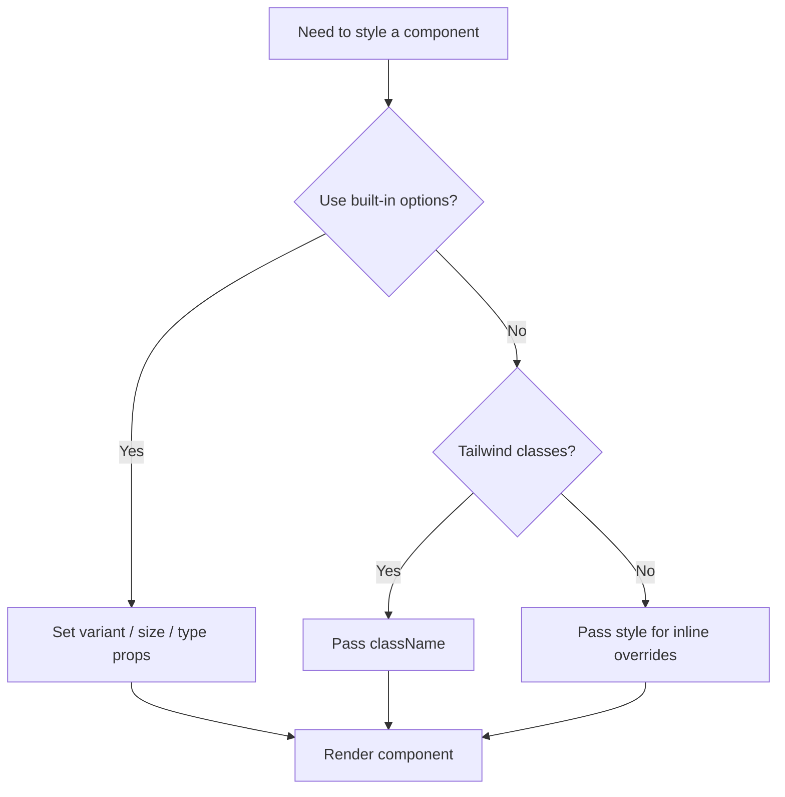

# Customization

Lumynar UI components are designed to be styled through three mechanisms: variant props, `className`, and `style`.

---

## Overview

| Method | Best for | Applies to |
|--------|----------|------------|
| Variant props | Using built-in design options | `Button`, `Badge`, `Alert`, `Card`, etc. |
| `className` | Tailwind overrides and extensions | All components |
| `style` | One-off inline overrides | Components that accept `style` (e.g. `Button`, `Image`) |

---

## Variant props

Many components expose `variant` and `size` props that map to predefined Tailwind class combinations.

```jsx
<Button variant="danger" size="lg">Delete</Button>
<Badge variant="success" size="sm">Active</Badge>
<Alert type="warning" message="Check your input." />
```

> **Note:** `Alert` and `Toast` use `type` (not `variant`) for their style prop.

### Available variants by component

| Component | Prop | Values |
|-----------|------|--------|
| `Button` | `variant` | `primary`, `secondary`, `danger` |
| `Button` | `size` | `sm`, `md`, `lg` |
| `Badge` | `variant` | `primary`, `secondary`, `success`, `danger`, `warning` |
| `Badge` | `size` | `sm`, `md`, `lg` |
| `Alert` | `type` | `info`, `success`, `warning`, `error` |
| `Toast` | `type` | `info`, `success`, `warning`, `error` |
| `Card` | `padding` | `none`, `sm`, `md`, `lg` |
| `Card` | `shadow` | `none`, `sm`, `md`, `lg` |
| `Paragraph` | `variant` | `body`, `small`, `caption`, `error` |
| `Heading` | `level` | `1`–`6` |

---

## `className`

Every exported component accepts a `className` prop. Classes are appended to the component's default Tailwind classes.

```jsx
<InputField className="border-2 border-blue-300 rounded-xl" />
<Card className="bg-gray-50" padding="lg" />
```

### Button behavior

When `className` is provided on `Button`, **default variant and size classes are not applied**. You control styling entirely:

```jsx
// Default variant classes applied
<Button variant="primary">Default</Button>

// Only your classes applied
<Button className="bg-purple-600 text-white px-6 py-3 rounded-full">
  Custom
</Button>
```

### Tailwind integration

Because components use Tailwind utility classes internally, the recommended approach is:

1. Configure Tailwind in your project (see [Getting Started](./getting-started.md))
2. Use `className` to align components with your design tokens

```jsx
<Button className="bg-brand-500 hover:bg-brand-600 text-white font-semibold">
  Brand Button
</Button>
```

---

## `style`

Pass inline styles for values that are difficult to express with utility classes.

```jsx
<Button
  variant="primary"
  style={{ backgroundColor: '#ff6b6b', padding: '15px 30px' }}
>
  Inline Styled
</Button>

<Image
  src="/photo.jpg"
  alt="Photo"
  width={300}
  height={200}
/>
```

`Image` applies `width` and `height` as inline styles automatically (numeric values become `px`).

---

## Customization workflow



---

## Tips

- **Prefer `className` over `style`** for maintainability and Tailwind consistency.
- **Use semantic variants** (`danger`, `success`) before writing custom colors.
- **Test after Tailwind config changes** — new utility classes require a dev server restart.
- **Do not modify source files** in `node_modules` — always override through props.

---

## Limitations

| Limitation | Detail |
|------------|--------|
| No theme provider | Design tokens are not centralized yet (planned for v0.2) |
| No CSS variables | Components do not expose CSS custom properties |
| No dark mode | Dark mode support is on the roadmap |
| Tailwind required | Components will appear unstyled without Tailwind in your app |

---

## Related documents

- [Getting Started](./getting-started.md) — Tailwind configuration
- [Components](./components.md) — prop reference
- [Troubleshooting](./troubleshooting.md) — styling issues
