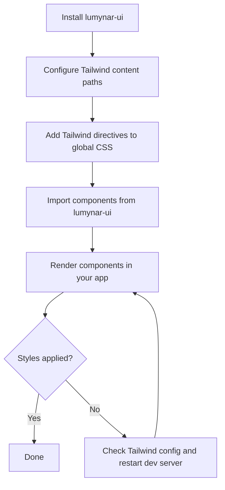

# Getting Started

This guide walks you through installing Lumynar UI, configuring Tailwind CSS, and rendering your first components.

---

## Prerequisites

| Requirement | Version | Required |
|-------------|---------|----------|
| React | 16.8+ | Yes |
| React DOM | Matching React | Yes |
| Tailwind CSS | v3+ | Yes |
| Node.js | 14+ | For local development only |

> **Warning:** Components use React hooks (`useState`, `useEffect`). React 15 and React 16.0–16.7 are not supported despite the peer dependency range. See [Compatibility](./compatibility.md).

---

## Installation

Choose your package manager:

```bash
npm install lumynar-ui
```

```bash
yarn add lumynar-ui
```

```bash
pnpm add lumynar-ui
```

```bash
bun add lumynar-ui
```

### Peer dependency conflicts

If your package manager reports peer dependency warnings:

```bash
npm install lumynar-ui --legacy-peer-deps
```

---

## Configure Tailwind CSS

Lumynar UI components render Tailwind utility classes. Without Tailwind configured in your app, components will appear unstyled.

### Step 1 — Add content paths

Include the compiled package output in your Tailwind `content` configuration:

```js
// tailwind.config.js
module.exports = {
  content: [
    './src/**/*.{js,jsx,ts,tsx}',
    './node_modules/lumynar-ui/dist/**/*.{js,jsx}',
  ],
  theme: {
    extend: {},
  },
  plugins: [],
};
```

### Step 2 — Include Tailwind directives

Ensure your global CSS imports Tailwind layers:

```css
/* src/index.css */
@tailwind base;
@tailwind components;
@tailwind utilities;
```

### Step 3 — Import global CSS

Import the CSS file in your app entry point:

```jsx
// main.jsx or index.jsx
import './index.css';
```

---

## Your first component

### 1. Import components

All public components are exported from the package root:

```jsx
import { Button, InputField, Card, Container, Alert } from 'lumynar-ui';
```

> **Tip:** Always import from `'lumynar-ui'`. Do not import from internal paths like `lumynar-ui/src/...`.

### 2. Render a layout

```jsx
import { Button, InputField, Card, Container, Alert } from 'lumynar-ui';

function App() {
  return (
    <Container>
      <Card>
        <h1>Welcome</h1>
        <InputField placeholder="Enter your name…" />
        <Button onClick={() => alert('Hello!')}>Click me</Button>
        <Alert type="success" message="Setup complete." />
      </Card>
    </Container>
  );
}

export default App;
```

### 3. Verify styling

If components render without styles:

1. Confirm Tailwind `content` paths include `node_modules/lumynar-ui/dist/**`
2. Confirm your global CSS includes `@tailwind` directives
3. Restart your dev server after changing `tailwind.config.js`

---

## Installation workflow



---

## Form example

A minimal contact form using multiple components:

```jsx
import { useState } from 'react';
import {
  Button,
  InputField,
  Label,
  Checkbox,
  FormWrapper,
  Card,
  Alert,
} from 'lumynar-ui';

function ContactForm() {
  const [email, setEmail] = useState('');
  const [agreed, setAgreed] = useState(false);

  const handleSubmit = (e) => {
    e.preventDefault();
    if (!agreed) return;
    console.log('Submitted:', email);
  };

  return (
    <Card>
      <FormWrapper onSubmit={handleSubmit}>
        <Label htmlFor="email" required>
          Email
        </Label>
        <InputField
          id="email"
          type="email"
          value={email}
          onChange={(e) => setEmail(e.target.value)}
          placeholder="you@example.com"
        />
        <Checkbox
          id="terms"
          label="I agree to the terms"
          checked={agreed}
          onChange={(e) => setAgreed(e.target.checked)}
        />
        <Button type="submit" variant="primary">
          Subscribe
        </Button>
      </FormWrapper>
      {!agreed && (
        <Alert type="warning" message="Please accept the terms to continue." />
      )}
    </Card>
  );
}
```

---

## Next steps

| Topic | Guide |
|-------|-------|
| Full component API | [Components](./components.md) |
| Styling overrides | [Customization](./customization.md) |
| React version support | [Compatibility](./compatibility.md) |
| Common problems | [Troubleshooting](./troubleshooting.md) |
