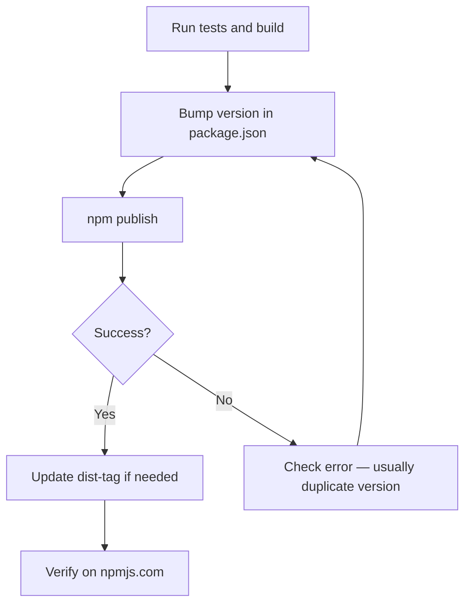

# Publishing

Guide for maintainers: local development linking, version management, and npm publishing.

---

## Overview

Lumynar UI is published to npm as [`lumynar-ui`](https://www.npmjs.com/package/lumynar-ui). The repository is hosted at [`nayem-ui-framework`](https://github.com/Nayem707/nayem-ui-framework).

| Artifact | Location |
|----------|----------|
| npm package | `lumynar-ui` |
| CJS entry | `dist/index.cjs.js` |
| ESM entry | `dist/index.esm.js` |
| Published files | `dist/`, `README.md`, `LICENSE` |

---

## Local development linking

Test the package in another project without publishing.

### Method 1 — npm link

```bash
# In the lumynar-ui repository
npm run build
npm link

# In your test project
npm link lumynar-ui
```

### Method 2 — Install from local path

```bash
# In your test project
npm install /path/to/lumynar-ui
```

### Method 3 — Pack and install tarball

```bash
# In the lumynar-ui repository
npm run build
npm pack
# Creates lumynar-ui-{version}.tgz

# In your test project
npm install /path/to/lumynar-ui/lumynar-ui-{version}.tgz
```

### Method 4 — Install from GitHub

```bash
npm install https://github.com/Nayem707/nayem-ui-framework.git
```

> **Tip:** After linking locally, rebuild when you change source: `npm run build`.

---

## Pre-publish checklist

Before every release:

- [ ] All tests pass: `npm test`
- [ ] Coverage meets threshold: `npm run test:coverage`
- [ ] Build succeeds: `npm run build`
- [ ] Version bumped in `package.json`
- [ ] CHANGELOG or release notes updated (if applicable)
- [ ] README and docs are accurate

---

## Version management

npm versions are **immutable**. You cannot republish an existing version.

### Bump version

```bash
# Patch: 1.2.0 → 1.2.1 (bug fixes)
npm version patch

# Minor: 1.2.0 → 1.3.0 (new features)
npm version minor

# Major: 1.2.0 → 2.0.0 (breaking changes)
npm version major
```

Or set the version manually in `package.json`.

### Check published versions

```bash
npm view lumynar-ui versions
npm view lumynar-ui version
npm view lumynar-ui dist-tags
```

---

## Publish workflow



### Publish command

```bash
npm run build
npm publish --access public
```

The `prepublishOnly` script runs `npm run build` automatically.

### Two-factor authentication

If your npm account requires 2FA for publishing:

```bash
npm publish --otp=123456
```

Enable 2FA:

```bash
npm profile enable-2fa auth-and-writes
```

---

## Update the `latest` dist-tag

If `latest` points to an older version:

```bash
npm dist-tag add lumynar-ui@1.3.0 latest
npm dist-tag ls lumynar-ui
```

---

## Common publish errors

| Error | Cause | Fix |
|-------|-------|-----|
| `403 — cannot publish over previously published versions` | Version already exists | Bump version with `npm version patch` |
| `403 — Forbidden` | Not logged in or no publish access | Run `npm login` |
| `402 — Payment Required` | Scoped package without `--access public` | Use `npm publish --access public` |
| Missing `dist/` in tarball | Build not run | Run `npm run build` before publish |

---

## What gets published

Defined in `package.json` `files` field:

```
dist/
README.md
LICENSE
```

Source files, tests, and documentation in `docs/` are **not** included in the npm package (except README).

---

## Related documents

- [Testing](./testing.md) — pre-publish test requirements
- [Contributing](../CONTRIBUTING.md) — contribution workflow
- [Troubleshooting](./troubleshooting.md) — install and publish issues
